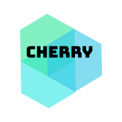

<p align="center">

[](https://jrj444.github.io/cherry/)

</p>

<p align="center">


</p>

### 介绍

这是一个我在学习 Vue 的过程中写的一个 UI 组件框架，目的在于提高自己对 Vue 的理解与运用。

全部的组件还是比较简单的，造轮子是一种很好的学习方式，希望对你有所帮助。

### 安装

推荐使用 npm 或 yarn 的方式进行开发

```shell script
npm install @jrj444/cherry-ui
```

或

```shell script
yarn add @jrj444/cherry-ui
```

### 快速上手

在 `main.js` 中按需引入组件，比如 Button

```js
import Vue from 'vue';
import {Button} from '@jrj444/cherry-ui';
import '@jrj444/cherry-ui/dist/cherry.css'
import App from './App.vue';

Vue.component("ch-button", Button);

new Vue({
  el: '#app',
  render: h => h(App)
});
```

这样就可以以 `<ch-button>` 的标签形式，在项目中使用 Button 组件啦

需要注意的是，样式文件 `cherry.css` 需要单独引入

### 文档

[Cherry UI 官网](https://jrj444.github.io/cherry/)